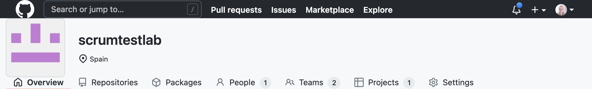

# UD4 - PRACTICA2 - Gusteau's Menu

* [1. Introducció](#1-introducció)
* [2. Configuració de Github com a ferramenta Scrum](#2-configuració-de-github-com-a-ferramenta-scrum)
  * [2.1. Creació d'una nova organització per al projecte](#21-creació-duna-nova-organització-per-al-projecte)
  * [2.2. Revisió del Panell de la Organizatizació](#22-revisió-del-panell-de-la-organizatizació)
  * [2.3. Panell de Projectes](#23-panell-de-projectes)
    * [2.3.1. Mode Projecte BETA](#231-mode-projecte-beta)
    * [2.3.2. Camps personalitzats](#232-camps-personalitzats)
    * [2.3.3. Gestió de les tasques](#233-gestió-de-les-tasques)
    * [2.3.4. Creació d'un repositori](#234-creació-dun-repositori)
* [3. Treball a realitzar](#3-treball-a-realitzar)
  * [3.1. Presentació](#31-presentació)
* [4. Bibliografia](#4-bibliografia)

En aquesta práctica, anem a posar en práctica l'aprés a la unitat anterior (U3) i aquesta (U4) al tems que ens serveix per a repassar.

El que es preten aconseguir es el següent:

* Utilitzar [github][github] per a gestionar el cicle de vida del desenvolupament de software
* Gestionar i planificar les tasques utilitzant [github][github]
* Gestionar el desenolupament del codi font mitjançant git
* Utilitzar git i github en per a treballar en grup.
* Repassar els conceptes vists a les unitats anteriors.

## 1. Introducció

L'equip de desenvolupament de la carta del restaurant *Gusteau's Menu* utilitza [La metodologia Àgil Scrum][Guia Scrum Oficial en Català] per al desenvolupament. D'aquesta manera, es capaç de poder anar millorant el producte i anar incorporant requisits de forma gradual a la carta.

Per a implementar Scrum, es poden utilitzar moltes ferramentes, en aquest cas, es pot utilitzar Github per a fer-ho utilitzant [el nou sistema beta beta de gestió de projectes](https://docs.github.com/es/issues/trying-out-the-new-projects-experience/about-projects), que ens permet tindré una visió i un control del nostre desenvolupament més enllà de la gestió d'un únic projecte associat a un repositori. 

## 2. Configuració de Github com a ferramenta Scrum

Per a utilitzar github com a ferrameta bàsica d'Scrum, s'han de realizar i tenir en compte les següents configuracions que son algunes necessàries i altres opcionals per al desenvolupament.

### 2.1. Creació d'una nova organització per al projecte

Les [organitzacions](https://docs.github.com/es/organizations/collaborating-with-groups-in-organizations/about-organizations) de github son com uns usuaris especials en els quals podem tenir projectes i usuaris associats per a un determinat projecte; ens permeteix gestionar d'una manera més indicada els projectes de software, ja que ens permet tenir, usuari, codi i grups, relacionats.

Per a crear-ne una, has d'anar al teu perfil en <https://github.com> i a l'esquerra el teu usuari, desplegar el menú i seleccionar `+ Create Organization` Accedim, en creem una i després entrem a aquesta organització per a gestionar-la. 

### 2.2. Revisió del Panell de la Organizatizació

Ara podem accedir a la nostra organitizació nova, en el cas de la creada per al grup <https://github.com/scrumtestlab> i veurem el panell d'administració:

1. **Overview** - Ens mostra els repositoris publics e informació
2. **Repositories** - Tots els repositoris creats de la organització
3. **Packages** - Paquets creats per a distribuir el software
4. **People** - Membres de la organització, en aquesta secció es en la que podem afegir  a nous membres.
5. **Teams** - Equips que ens permeten agrupar membres i gestionar els repositoris i els permisos.
6. **Projects** - Projectes de la Organització ( Aquests projectes ens permeten agrupar repositoris)
7. **Settings** - Configuració de la organització.

### 2.3. Panell de Projectes

Aquest panell ens permet gestionar les tasques pendents per als projectes, podem tindre projectes per a gestionar les tasques dels repositoris ( tasques associades a repositoris git) o bé **tasques genèriques** que encara no estiguen associades ( aquestes tasques s'utilitzen per a definir funcionalitat o per a treballar en el client mentre capturem requisits )

Quan accedim a aquesta finestra, ens permet crear projectes i tenim dues opcions:

1. **New Project** - Modo Beta, aquest mode ens permet gestionar les tasques entre diversos repositoris ( recorda molt a la interfície de Atlasian Jira)
2. **New Project** - Classic, aquest sols ens deixa crear tablers kanban per a la gestió dels projects.

Nosaltres hem creat un nou projecte beta, de forma que ens permet crear diferents vistes de gestió del projecte, i es completament personalitzable.

El projecte que hem creat [Gusteau's Menu][Gusteau's Menu] ens permet gestionar totes les tasques de desenvolupament relacionades en la millora de la carta del restaurant. Ens permet tindre totes les vistes que necessitem:

1. Una vista per a la gestió de Backlog ( En mode Projecte Beta)
2. Un altra per a la gestió de l'Sprint ( En mode kanban)
3. Podem crear totes les vistes que necessitem i del tipus que vulguem:

> En aquesta tasca encara estem al principi, i no hem realitzat cap sprint per això, tota les **tasques o funcionalitats** a desenvolupar estan a BackLog

#### 2.3.1. Mode Projecte BETA

En aquesta vista, hem definit el **Project Plan** que es una vista personalitzada que utilitzem per a gestionar el projecte de manera completa. Aquesta vista ens permet:

* Ordenar per diferents camps
* Filtrar. 
* Agrupar.
* Afegir noves columnes ( amb valors personalitzats) ( Botó + )
* Ocultar/mostrar/eliminar columnes
* Des de la configuració, podem editar les columnes personalitzades

#### 2.3.2. Camps personalitzats

Des de el botó :heavy_plus_sign: se'ns mostra un menú que ens permet realitzar les següents **accions**:

1. **(+ New Field)** - Aquest camp en permet crear els següents valors personalitzats per a les tasques
   * Camp de Text
   * Número
   * Data
   * Selecció única ( Nosaltres indiquem les opcions )Iteració ( Aquest ens permet )
2. **Title**
3. **Status** ( Es un camp de selecció única que es crea per defecte ) - tots els camps personalitzats van aquí ( En el projecte d'example teniu Artifcats )
4. **Labels**
5. **Milestone**
6. **Assignees**
7. **Linked Pull Requests**
8. **Repository**

> Els valors del 4 al 8 no estaran disponibles mentre aquesta tasca no estigui també a un repositori, es a dir, tinga un repositori git associat.

> Com es pot observar, podem utilitzar emojis per a millorar la visibilitat del nom de les categories

Per a facilitar la gestió del projecte mitjançant Scrum, s'ha proposat modificar el camp `Status` i afegir un nou camp `Artefacte`:

#### 2.3.3. Gestió de les tasques

Una vegada tenim mes o menys clar com treballar y les categories creades, procedim a anar creant les tasques. Afegim totes les tasques que necessitem i, una vegada creades, podem modificar la seua descripció en `markdown` seleccionant la tasca:

> No es necessari que espiguen creades totes les etiquetes/categories amb anteriorita, perquè podem afegirles més tard.

Descripció de la Tasca:

Descripció de la Tasca en Markdown:

> Al utilitzar [makdown][markdown] podem inclure imatges, etc. Per a aquest apartat, seria molt interessant modificar El menú i afegir una captura de la carta actual, així, ens queda per a referència.

#### 2.3.4. Creació d'un repositori

Una vegada hem definit diverses tasques en el backlog, ha arribat el moment de anar per feina, i començar a treballar, per tant, ara l'equip es quan es reuneix i decideix que va a l'**Sprint**. En aquest cas, caldria utilitzar la columna `Artifact` per a definir que ja no es Backlog ( es a dir que passa a ser backlog de l'Sprint) i definir opcionalment, en un camp personalitzar la iteració.

En aquest cas, també, podriem treballar en algun dels taulers [kanban que tenim y/o configurarlo com considerem][Adaptar la vista del projecte], per a localitzar sols el que anem per a l'Sprint.

Una vegada tenim configurades totes aquestes tasques, hem de decidir si les associem a un repositori (que forme part de la organització ) per a poder tindre noves funcionalitats disponibles ( la de etiquetes, milestones, etc). En un projecte real, es poden tindre diversos repositoris de codi associats al projecte (Per exemple, un repositori per al codi Android, un altre per a la part del servidor, etc). Nosaltres en aquest cas, sols en tindrem un compartit per tots el membres.

## 3. Treball a realitzar

1. Establiu grups de 3 persones u de 4.
2. Creeu una organització i afegiu-se tots els membres del grup com a usuaris amb privilegis d'edició ( afegiu també a l'usuari arturocandela ).
3. Utilitzant com a referència el projecte [Gusteau's Menu][Gusteau's Menu] crea la pila del producte ( Backlog - amb la informació del projecte que s'indica )
4. Realitza la reunió de l'Sprint Planning per a decidir les tasques i estableix l'SprintBacklog ( amb ajuda del PO i Scrum Master - arturocandela) 
5. Crea un nou repositori per a que tots els membres del grup puguen treballar.
6. Associa les tasques al repo / crea'n de noves per a poder realitzar i documentar tots els elements del backlo
7. Cada membre del grup, ha de començar a treballar en la seua tasca i assignarse-la, encara que possiblement, per a l'apartat del menú, tingueu que treballar tots a una ( o no )
8. Cal gestionar les branques adequadament, cal crear una nova branca per cada tasca que estiga desenvolupant-se.
9. Quan es faça un commit/push, cal tancar la tasca si ja està finalitzada i realitzar el pull-request ( en aquest cas, també hem de llevar-nos la assignació) - La documentació del commit i de la tasca s'ha de realitzar adecuadament.
10. Una vegada finalitzat tots els commits, es realitzarà l'Sprint Review/Retrospective a classe.
10. Realitza els flux de manera adecuada.

### 3.1. Presentació

* [ ] Enllaç al projecte a github ( una entrega per grup)

## 4. Bibliografia

1. [Logo Gusteau's](https://www.teepublic.com/es-mx/pegatina/9089150-gusteaus-anyone-can-cook-ratatouille)

2. [Gusteau's Menu Githubproject][Gusteau's Menu]

3. [Guia Scrum Oficial en Català][Guia Scrum Oficial en Català]

4. [Adaptar la vista del projecte][Adaptar la vista del projecte]

5. Com utilitzar els issues en el commit

[makdown]: https://markdown.es/sintaxis-markdown/
[github]: https://github.com
[Gusteau's Menu]: https://github.com/orgs/scrumtestlab/projects/2
[Guia Scrum Oficial en Català]: https://scrumguides.org/docs/scrumguide/v2020/2020-Scrum-Guide-Catalan.pdf	"La Guía Scrum Offical en Català"
[Adaptar la vista del projecte]: https://docs.github.com/es/issues/trying-out-the-new-projects-experience/customizing-your-project-views

